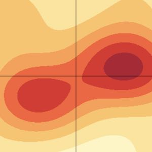

# ramachandran

*Make Ramachandran plots from pdb files.*

## Install

    pip install -r requirements.txt

## Parsing the chain

To parse 3u8z to a sequence of rotations:

    ./bin/parse 3u8z

Protein files are automatically downloaded from the [RCSB Protein Data Bank](https://www.rcsb.org/).

## Plot rotations and Ramachandran

To plot 3u8z:

    ./bin/plot 3u8z

To plot only for Proline:

    ./bin/plot 3u8z pro

Use `--log` to scale y axis:

    ./bin/plot 3u8z --log

## Other stuff

To list all local files:

    ./bin/list

By default we use `.pdb` files. Some structures are only available in the CIF format. Use `--format` to specify:

    ./bin/plot --format cif
